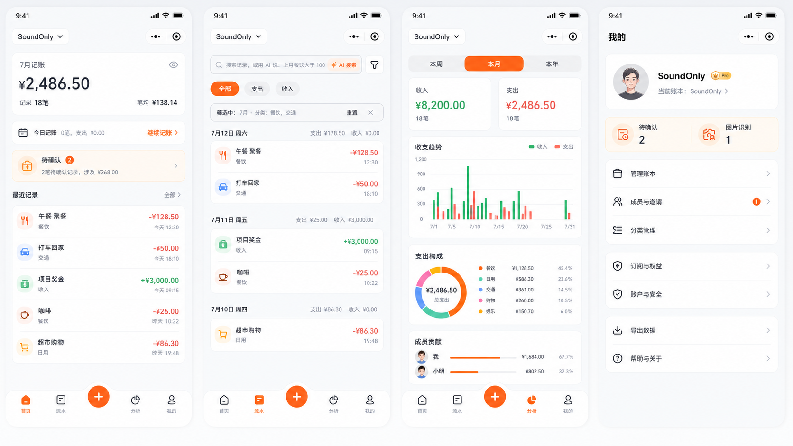
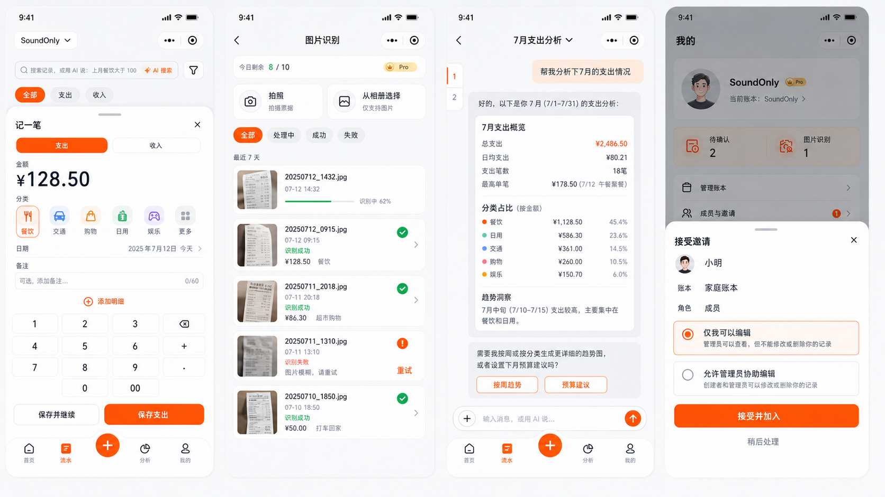

# shared-ledger 微信小程序设计方案

> 状态：微信原生页面骨架、四个主 Tab 与核心子页面已落地。
>
> 工作分支：`codex/wechat-mini-program`

## 1. 设计目标

微信小程序版本不是 Web 页面的简单缩放，也不通过 WebView 包装现有站点。它使用微信原生页面模型重新实现移动端体验，同时复用 shared-ledger 已有的后端业务、数据约束和共享类型。

核心目标：

- 保持 `首页 / 流水 / 分析 / 我的` 四个主入口和中间记账按钮。
- 覆盖记账、交易详情、图片识别、待确认、AI 助手、账本、成员邀请、分类、订阅和账户等现有核心能力。
- 符合微信小程序胶囊按钮、安全区、页面栈、授权和网络请求约束。
- 小程序只调用 shared-ledger API；Aleph AI Platform 和 Aleph-OCR 仍由 API Worker 通过 Service Binding 调用。
- 不复制 Web DOM 组件和 CSS，避免两套运行时互相牵制；只复用领域 schema、类型、校验规则和 API 契约。

非目标：

- 不在第一版引入支付、微信消息订阅或公众号能力。
- 不恢复 PDF、CSV、Excel 导入；图片识别仍只对 Pro 用户显示。
- 不使用浏览器 cookie 作为小程序登录状态的唯一载体。

## 2. 视觉方向

### 四个主页面



### 关键工作流



概念图用于确定信息层级、品牌色和空间感，最终实现需遵守微信胶囊按钮和真实安全区；图中弹层/底栏的位置不是像素级实现约束。

### 视觉原则

- 延续当前品牌橙色，主背景使用低对比浅灰，内容卡片使用白色。
- 不使用大面积渐变或高强度阴影；主要通过留白、圆角和浅色描边建立层级。
- 顶部内容必须避开微信右上角胶囊按钮，动态读取 `getMenuButtonBoundingClientRect` 计算标题栏。
- 底部导航适配 `safe-area-inset-bottom`，中间加号保持明确但不遮挡列表内容。
- 金额、状态、失败原因和待处理数量优先视觉化，辅助文案保持克制。

## 3. 技术选型

使用微信原生小程序运行时创建 `apps/mini-program`，页面直接由 WXML、WXSS、TypeScript 和 JSON 组成。

选择原因：

- 不引入跨端运行时，页面生命周期、组件属性、事件和网络请求都使用微信原生 API。
- 原生自定义 TabBar 实现四个主 Tab 与中间记账按钮。
- `wx.request`、`wx.uploadFile`、`wx.chooseMedia` 与 `RequestTask` 直接对接现有 API。
- 独立结构检查和 Node 测试纳入 pnpm monorepo，不依赖 Web 构建链路。

## 4. 目录结构

```text
apps/
  api/                         # 现有 Cloudflare Worker API
  web/                         # 现有 Web 客户端
  mini-program/
    project.config.json        # 微信开发者工具项目配置
    miniprogram/
      app.ts
      app.json
      app.wxss
      custom-tab-bar/
      components/
        page-header/
        transaction-row/
      pages/
        home/
        records/
        analysis/
        settings/
        login/
        record-form/
        transaction-detail/
        imports/
        categories/
        members/
        ai/
      services/
        api.ts
        session.ts
      utils/
        format.ts
        transactions.ts
    scripts/validate.mjs
    test/
packages/
  shared/                      # 复用 schema、类型、纯校验逻辑
```

禁止从 `apps/web` 直接导入组件、CSS、React Router 或浏览器专用代码；小程序源码中不得出现 Taro、React 或 WebView 运行时。

## 5. 页面与分包

### 主包

主包只保留启动、认证恢复和四个高频 Tab，控制首包大小：

- `pages/home/index`：首页。
- `pages/records/index`：流水。
- `pages/analysis/index`：分析。
- `pages/settings/index`：我的。
- 自定义 TabBar：`首页 / 流水 / + / 分析 / 我的`。

中间 `+` 不是独立 Tab。点击后在当前页面打开操作面板：

- 记一笔。
- 图片识别（仅 Pro 显示）。
- AI 助手。

### transaction 分包

- 新增交易：支出/收入、金额、分类、日期、备注、附件、明细。
- 交易详情：金额与摘要固定，只有明细列表滚动；无明细时自动降低弹层高度。
- 编辑、复制、删除确认。

### import 分包

- 选择拍照或相册图片。
- 最近 7 天识别任务：全部、处理中、成功、失败。
- 图片缩略图、进度、失败原因、重试和取消。
- 待确认记录：编辑、确认、忽略、全部确认。

### ai 分包

- 会话列表、重命名、删除、清空当前会话。
- 通用聊天、结构化工具结果、确认卡片、图片附件。
- 流式输出、停止响应、自动滚动与回到底部。
- Agent 返回筛选结果时跳转流水页并同步筛选状态；搜索仍是一次性操作，不写入普通聊天会话。

### collaboration 分包

- 成员列表、角色、邀请、撤回、提醒、接受和拒绝邀请。
- 创建者保护、成员退出和管理员移除。
- 邀请链接通过小程序启动参数/场景值恢复，登录后继续完成邀请流程。

### settings 分包

- 管理账本、切换账本。
- 用户级分类管理。
- 个人资料、头像、用户名和安全设置。
- 订阅权益、升级入口、导出、帮助与关于。

## 6. 四个主页面

### 首页

- 顶部账本切换器位于胶囊按钮左下方安全区域。
- 本月收入、支出与余额摘要。
- 今日记账数据。
- 待确认和图片任务只在有数据时出现；只有一种任务时使用单卡片布局。
- 最近交易展示固定数量，点击在当前页面打开交易详情，不重新加载底层页面。
- 空数据与 API 局部失败时保留完整页面骨架，只显示 0 值和空态。

### 流水

- 搜索框支持普通关键词和显式“AI 搜索”。
- `全部 / 支出 / 收入` 为基础切换，不显示额外“已筛选”条。
- 高级筛选使用漏斗按钮；仅存在日期、金额、分类、来源或 AI 条件时显示重置条。
- 按日期分组交易，长标题最多两行，金额不被挤压。
- 交易详情不改变 Tab 页面状态。

### 分析

- 时间范围固定为本周、本月、本年。
- 只展示收入和支出，不展示结余系列。
- 图例可切换收入/支出，关闭后的图例变灰。
- 本周按周一至周日、本月按自然日、本年按 1 至 12 月展示，未来日期值为 0。
- 图表点击提示只展示货币符号和值。
- 支出构成和成员贡献与同一时间范围同步。

### 我的

- 头像与个人资料入口。
- 待确认/图片任务按有数据才显示。
- 成员与邀请统一入口，未查看邀请显示 badge，底部“我的”Tab 同步 badge。
- 管理账本、分类管理、订阅、账户与安全、导出、帮助、退出登录。
- 不放置与“我的”重复的独立设置入口。

## 7. 登录与账户绑定

### 微信登录流程

```text
小程序 wx.login()
  -> POST /api/auth/wechat/session { code }
  -> API Worker 使用 AppID/AppSecret 换取 openid/session_key
  -> 查询 auth_identities(provider = "wechat")
  -> 登录已有用户，或进入创建/绑定账户流程
```

后端接口：

- `POST /auth/wechat/session`：消费一次性 code；首次登录创建用户、free 订阅、默认账本和默认分类，再返回 access/refresh token。
- `POST /auth/refresh`：接收轮换 refresh token，返回新的 access/refresh token。
- `POST /auth/logout`：撤销当前小程序 access/refresh token。

规则：

- `auth_identities` 继续作为密码和微信身份的统一映射表。
- 不能按昵称或头像自动合并账号。
- AppSecret 只存 Cloudflare secret，绝不进入小程序包或普通 API 响应。
- 头像可以使用微信选择头像能力，但上传和保存仍走 shared-ledger 用户资料接口。

## 8. Session 与 API 客户端

浏览器 cookie 不适合作为小程序唯一认证方式。API 需要同时支持 Web cookie 与小程序 Bearer token：

- access token：短期有效，放在 `Authorization: Bearer <token>`。
- refresh token：轮换并存储在小程序本地存储；服务端保存哈希并可撤销。
- 收到 401 时进行一次互斥 refresh，并重放原请求；refresh 失败才清理状态并进入登录页。
- API client 统一附加 `bookId`、时区、request id 和客户端版本。
- 不在日志中输出 access token、refresh token、微信 code 或 session key。

环境地址：

- preview：`https://dev.leger.aleph-cat.com/api`
- production：`https://leger.aleph-cat.com/api`

以上 HTTPS 域名需加入微信公众平台的 request/upload/download 合法域名配置。

## 9. AI 流式通信

小程序继续消费现有 Agent 流式事件，不新增另一套 AI 协议：

- 使用 `wx.request({ enableChunked: true })`。
- 通过 `RequestTask.onChunkReceived` 接收 ArrayBuffer。
- 使用增量 `TextDecoder` 解码，并按 SSE 的 event/data 边界解析。
- 保留 `message_delta`、`skill_selected`、`step_started`、`tool_call`、`tool_result`、`confirmation`、`done`、`error`。
- 停止响应调用 `RequestTask.abort()`，UI 清理思考状态但保留已收到内容。
- 断流不把错误文本持久化成 assistant 消息。

如果微信基础库在目标版本不支持稳定的 chunked 行为，发布门槛应阻止上线，而不是退化为定时重复请求。

## 10. 图片识别

- 只支持图片，不支持 PDF、CSV、Excel。
- free 用户不显示识别入口；API 仍返回 403 防止绕过。
- Pro 用户从相机或相册选择图片，使用 `wx.uploadFile` 上传原图。
- 小程序只调用 shared-ledger API；OCR 的 API key、Webhook secret 和 Service Binding 不下发客户端。
- 任务状态通过当前 SSE/状态接口消费，页面隐藏或断流时降级为有上限的轮询。
- 列表只请求最近 7 天任务；缩略图按需加载，不一次性渲染原图。
- 每日成功额度仍按后端 `image_ocr_usage` 判断，客户端展示只作提示。

## 11. 状态管理与缓存

- 认证、当前账本、邀请 badge 和 Sheet 状态放在小型全局 store。
- 服务端数据使用按 query key 缓存的请求层；切换账本时只失效账本相关 key。
- 打开交易详情、记一笔或成员弹层不应重新请求 `/books`，也不能让底层页面进入 skeleton。
- 页面 `onShow` 只进行必要的 stale 校验，不进行无条件全量刷新。
- 创建/更新成功后通过精确 cache patch 或 invalidation 更新相关列表。
- 本地草稿按 `userId + bookId + formType` 隔离，保存成功立即删除。

## 12. 组件与交互规范

- `AppHeader`：自动适配状态栏和胶囊按钮。
- `CustomTabBar`：四 Tab + 中间动作按钮，支持“我的”badge。
- `LedgerPill`：当前账本、切换箭头和加载状态。
- `BottomSheet`：用于当前页面的短流程；复杂流程进入分包页面。
- `TransactionRow`：最多两行标题，金额固定宽度，分类为弱化信息。
- `AmountText`：收入绿色、支出橙红，符号和小数格式统一。
- `StatusChip`：处理中、成功、失败、待确认。
- `EmptyState`：不替代整个页面，只填充数据区域。
- 所有破坏性操作必须使用确认弹窗；确认按钮明确描述结果。
- 触控目标不小于 44px，文字不使用依赖 hover 的交互。

## 13. 后端改动清单

- 增加微信 code 登录、注册和账号绑定服务。
- 认证中间件支持 cookie 与 Bearer 两种传输方式，权限语义保持一致。
- refresh token 轮换、撤销和审计覆盖小程序客户端。
- CORS 不作为小程序鉴权保障；所有写操作继续执行用户、账本和角色检查。
- 上传、Agent、OCR、订阅额度和审计仍复用现有服务，不在小程序端重写业务规则。
- API schema 由 `@shared-ledger/shared` 导出，小程序使用同一响应解析。

## 14. 测试与发布门槛

### 自动测试

- 微信登录：新用户、已有微信身份、绑定密码账户、重复绑定、无效 code、解绑保护。
- Bearer auth：access 过期、并发 refresh、refresh 撤销、登出后不可复用。
- 页面：四个 Tab、记账、交易详情、筛选、分析、我的 badge。
- 图片：free 入口隐藏、Pro 上传、额度耗尽、失败/取消/待确认。
- AI：chunked SSE、停止响应、confirmation、筛选同步、断流恢复。
- 邀请：从分享链接冷启动、登录后继续、接受/拒绝、无权限。

### 真机验收

- iOS 与 Android 微信各至少一台真机。
- 检查胶囊安全区、底部安全区、键盘顶起、长列表、图片上传和分包首次加载。
- 弱网下验证登录 refresh、AI 流式、OCR 状态与重复提交保护。
- 检查隐私协议、用户信息/相册/相机授权文案和拒绝后的可恢复路径。

### CI

建议新增命令：

```text
pnpm --filter @shared-ledger/mini-program check
pnpm --filter @shared-ledger/mini-program typecheck
pnpm --filter @shared-ledger/mini-program test
```

PR 必须完成构建；preview 上传体验版，主分支通过审核后再发布正式版。

## 15. 实施顺序

这不是分阶段交付方案，而是一次完整实现时的工程依赖顺序：

1. 创建微信原生应用骨架、token、基础组件和自定义 TabBar。
2. 完成微信登录、Bearer session、API client 和错误处理。
3. 接入首页、流水、分析、我的真实数据。
4. 完成交易、分类、账本、成员和邀请流程。
5. 完成图片识别、待确认和 AI 流式通信。
6. 补齐订阅、账户、导出、空态、权限态和深链。
7. 自动测试、开发者工具、iOS/Android 真机和 preview 环境验收。

最终交付只接受完整小程序，不以静态 mock 替代后端能力。

## 16. 编码前需要的外部配置

- 微信小程序 AppID。
- 微信公众平台的开发者权限。
- preview/prod 合法 request、uploadFile、downloadFile 域名。
- Cloudflare preview/prod 的 `WECHAT_MINI_APP_ID` 与 `WECHAT_MINI_APP_SECRET`。
- 隐私保护指引和相机/相册用途说明。
- 体验版成员名单和正式发布主体资料。
